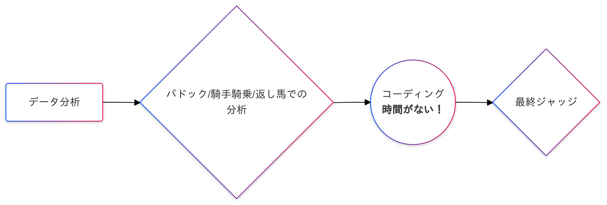
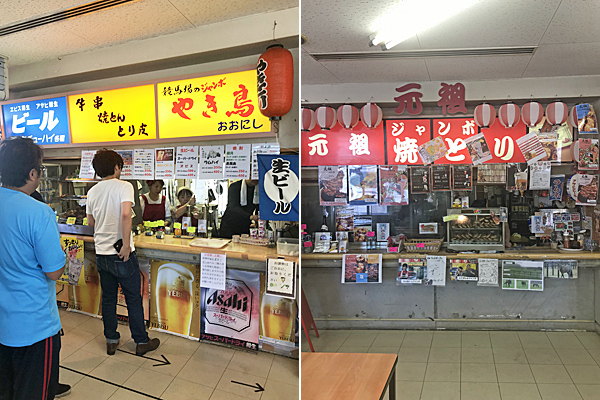
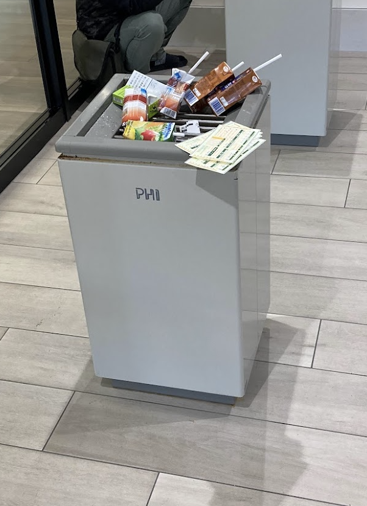
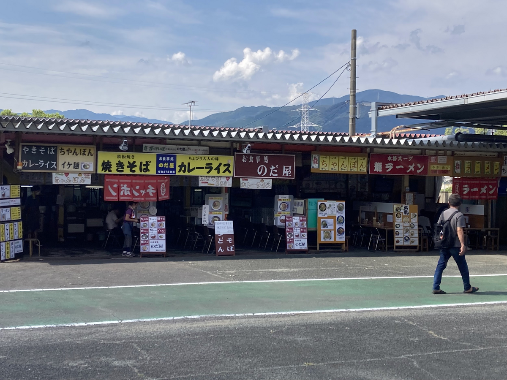
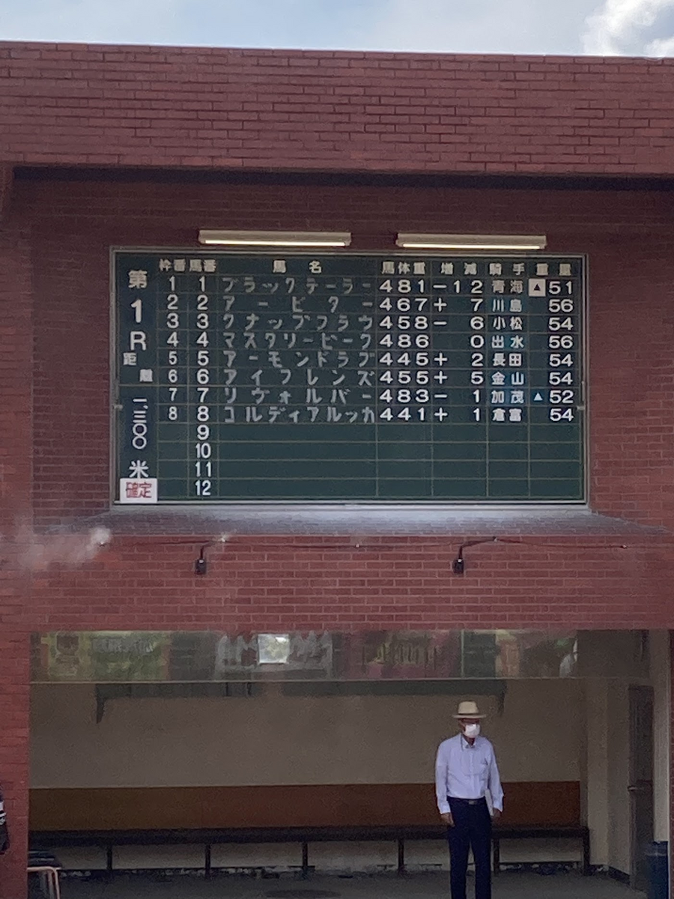

# テレワーク環境としての公営賭博施設
コロナ禍で広まったテレワークであるが、場所を問わないという利点がある。お好みの町のお好みのコワーキングスペースでできる。なんなら電波さえあれば、川のそばでやってもいい。  
なら、ギャンブルやりながらやったら稼ぎながら稼げるし、負けても常に給与というバフがかかっているんだから、実質負けなしだよね？という発想からきている。  
最近日本の地方競馬場を制覇した。チャリやバイクもそこそこ行っている。そこでテレワーク環境が良い公営賭博施設を紹介する。ギャンブリング・テレワーク(G.T)とこれを呼称する

## 競馬
そもそも競馬はG.Tに向かない。シンプルにタスクをこなす時間がない。データ分析、パドック/騎手騎乗/返し馬での分析、最終ジャッジというフローが長すぎるからである。  

ただ、パドックでの分析は全くもって無意味であると先生も言っているし、常に馬で草原で走っているモンゴル人でもパドックでの分析は連れて行かないと意味ないだろう。  

しかしバッチ方式（パドックを無視し一度に数レース分の馬券を購入し、時間を確保するジツ）で馬券を購入することで大きく時間を取得し、タスクを進めるということを行えば、競馬場でも十分G.Tは実現される。  
三競オートにおいて最も市場が大きいのが競馬であるし、その分施設も豪勢である。なのでここでのG.Tは癖があるが、ある意味最も快適とも言える。  

### 川崎競馬場
特別観覧席が1000円と首都圏にしてはまあまあ安い。設備としては無料ドリンクバーもあるし、モバイルオーダーで酒（基本濃い）を頼むことができるし、とても快適なG.T.を行うことができる。  
メシも豊富で、有名な激辛たこ焼きや激辛焼きそばをはじめ、多種のギャンブル飯がある。クラフトビールロジータは若干高い（金は増えるので問題ない）が美味しいし、どこのレモンサワーも大抵アホみたいに濃い、これは川崎という土地柄だろうか。  
問題は無料給茶機を突然廃止したり、ペグシルを置かなくなった意識の高さだろうか。何を思ったのかギャンブル場の聖域である無料給茶機を突然やめた。あれは持ち込み焼酎に割材として使える爺さんの憩いの場ですらある。南関東競馬の一角を担っており、どう考えても儲かっていると言うのに意味不明なコストカットを行ったことがある。これはいけない。  
予約システム導入に関しては賛否あるかと思うが、突然行きたくなった場合わざわざチケットペイというタコみたいなサイトを開いて予約しないといけない。しかもシステム利用料金で100円上乗せされる。これは本当に良くない。  
と最後は辛口になったが、南関東競馬他3場と比べてのアクセスの良さや、コンパクトで異常に歩く必要がない（空港ばりにでかい東京や中山、お前らや）という利点も多々ある。個室もあるので初めてのテレワークにおすすめ。  

### 盛岡競馬場
川崎と比べてアクセスが本当にカスだが、広大な駐車場や無料バスがあるので我慢したいと思う。ここの良さはメシの旨さ・自然の豊かさである。  
メシの旨さはジャンボ焼き鳥を筆頭とするB級グルメが豊富で、屋台村の店構えも素晴らしい。

入り口のメイセイオペラ像でテンションが上がった後にメシを買いつつパドックを鑑賞し、爆勝ち、納税しつつ自分も懐も暖かくなるという完璧なシナリオが存在する。  
無いと思うが、ギャンブルに敗北した場合、沈床庭園と言う庭園もある。ここで思考盗聴を行う卑劣なNARスタッフの目を掻い潜るために頭にアルミホイルを巻き直すといい。なるべくWi-Fiには近寄らないようにし、馬券検討の際は監視カメラにも注意だ（この庭園には卑劣なカメラはなさそうだ）。  
特別観覧席は1000円である。田舎にしては高いが、ここは課金した方がいい。山の上ということもあって天気が結構変わりやすい。昼間は良くても夜になると寒い。  
また、ここの馬主席は特別観覧席を区切っただけなので、1000円課金するだけで馬主気分になれる。  

### 高知競馬場
アクセスを除けばTier最強の地方競馬場である。コンパクトだし、メシの旨さ/安さ/独自性もある。また2,000円(高いが値段に見合っている設備)課金するとラグジュアリーな特別観覧席に行くこともできる。  
しかし車で来ることを前提とした作りになっているため、路線バスや無料バスを使うと1~2時間に一本である。うまく時間を狙わないと、2km(30)分歩かさせるバス停もあったりする。  
名物レース「高知一発逆転ファイナルレース」を生で見た時は感動した。本当に逃げ馬が失速して意味不明な馬に差されていたからだ。  
>弱い馬を集めてヨーイドンという予想不可能かつ高配当が生まれるレース。高知から始まり、佐賀(ウーマンチャンス)や川崎(ファイナルアンサー賞)にも似たようなレースができた。オリジナルだからか、高知のファイナルレースの方が払い戻しが高い。

しかし、施設そのものを綺麗にしても、そこにいるのは博徒というのも忘れずに。

### 佐賀競馬場
熊本に存在した荒尾競馬場の廃止を機に九州最後の地方競馬になった。今すぐ復活して欲しい。本当に許せない。  
10年ほど前までは赤字だったが、「うまてなし」をテーマにリニューアル後、ほとめきナイターといったナイター競馬を主軸に努力が見える競馬場である。実際売り上げも黒字転換し、最近のネット投票の追い風もあり「いい感じ」になっている。  
ただ実際行った限り、土日の開催の時にJRAの場外販売が一番盛り上がっており、中央のメインレースが終わった後は、負けた人か自分のような地方競馬が好きなオタクか地元のお爺さんしか存在しない。ここが素晴らしい。  
ただ、自家用車で来ない限り、最終レースまで見ると鳥栖駅まで1時間歩くかタクシーを使うことになる。無料バスを使う場合はその限りではない。自家用車で来る場合は駐車場が無限に広いので交流重賞（人多すぎるし多分渋滞で道が終わってる）じゃない限り平気だと思う。

食堂が素晴らしい。  

手書きの黒板も素晴らしい（ネット中継見てると反対側に電光掲示板ができてたがどうなんだろう）  

## コラム：ポモドーロテクニックとギャンブル
ポモドーロテクニックは、以下である。  
>ポモドーロテクニックは、25 分間の集中作業と5分間の休憩を繰り返す時間管理術で、集中力を維持しながら生産性を高める効果があります。

この後に競輪の出走表を見てみよう。なんと30分ごととなっている！！！  

| レース | 級別 | 区分 | 発走時刻 | 締切時刻 | 車数 |
|---|---|---|---|---|---|
| 1R | A級 | 一般 | 10:25 | 10:20 | 7 |
| 2R | A級 | 一般 | 10:55 | 10:50 | 7 |
| 3R | A級 | 準決勝 | 11:20 | 11:15 | 7 |
| 4R | A級 | 準決勝 | 11:50 | 11:45 | 7 |
| 5R | A級 | 準決勝 | 12:25 | 12:20 | 7 |
| 6R | S級 | 一般 | 12:55 | 12:50 | 6 |
| 7R | S級 | 一般 | 13:25 | 13:20 | 7 |
| 8R | S級 | 選抜 | 13:55 | 13:50 | 7 |
| 9R | S級 | 選抜 | 14:25 | 14:20 | 7 |
| 10R | S級 | 準決勝 | 14:55 | 14:50 | 7 |
| 11R | S級 | 準決勝 | 15:30 | 15:25 | 7 |
| 12R | S級 | 準決勝 | 16:10 | 16:05 | 7 |

これはつまり国推奨の脳トレであり、予想→作業(コーディングなど)→レース観戦というパラレル・ブレイン・ユージングによってGDPを総上げするという施策だろう。  
特別観覧席にWi-Fiがあったり、机があるのも、これを推し進めるための裏施策であるに違いない。スタバでスコーンとコーヒーを頼むと1000円超えるが、公営競技場なら金が増える（こともある）上に設備がさらに上位互換である。

## 競輪
### 平塚競輪場
### 小田原競輪場
### 名古屋競輪場
### 静岡競輪場
### ドーム：前橋&小倉
### 佐世保競輪場
## 競艇
## オートレース
### 川口
### 飯塚

